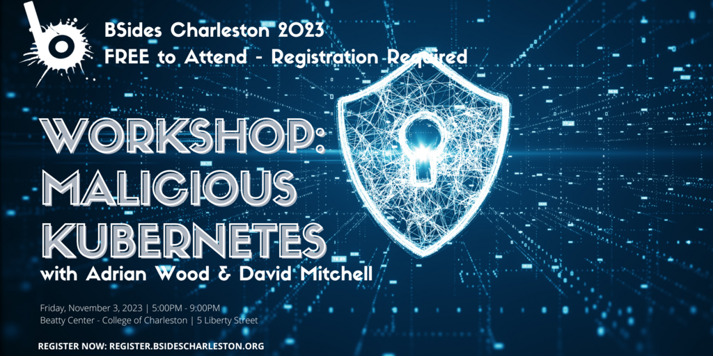

# BSides Charleston - Malicious Kubernetes Workshop

This repository contains the slides and accompanying lab materials for the BSides Charleston Workshop - Malicious Kubernetes. This workshop is an introduction to Kubernetes and container security. We will cover the basics of Kubernetes, how to deploy a cluster, and how to deploy malicious containers to the cluster. We will also cover how to detect and respond to malicious containers in a cluster. The workshop content is an update of the [Malicious Containers Workshop](https://forum.defcon.org/node/246020) presented at DEF CON 31.

## Instructions
If you have not already, please register for the workshop at [BSides Charleston](https://bsidescharleston.org/). The workshop will be held on Friday, November 3rd, 2023 from 5:00 PM - 9:00 PM EST. The workshop will be held on the College of Charleston campus at the Beatty Center. Also, be sure to check out the other great workshops and talks at BSides Charleston the following day.

If you have any questions, join the [BSides Charleston Slack](https://bsidescharleston.herokuapp.com/) and ask in the dedicated workshop channel. You can also ping direct message the presenters on Slack.

Use the [Lab Setup](Lab%20Setup.md) for instructions on setting up the lab environment you will use during the workshop.

Use the [Lab Walk Thru](labs_walk_thru.md) as an accompanying guide and to easily copy/paste commands to your lab from the various exercises.

Use the [Cheat Sheet](cheatsheet.md) for trouble shooting any issues you might encounter or learning how to exit vi.

## Presenters

### Instructor: David Mitchell

> @digish0\
> https://digital-shokunin.net

### Instructor: Adrian Wood 

> @whitehacksec\
> https://5stars217.github.io

### TA: Jan Nunez

> @theprobingteep

## Our lockpick/hacker(space) group

